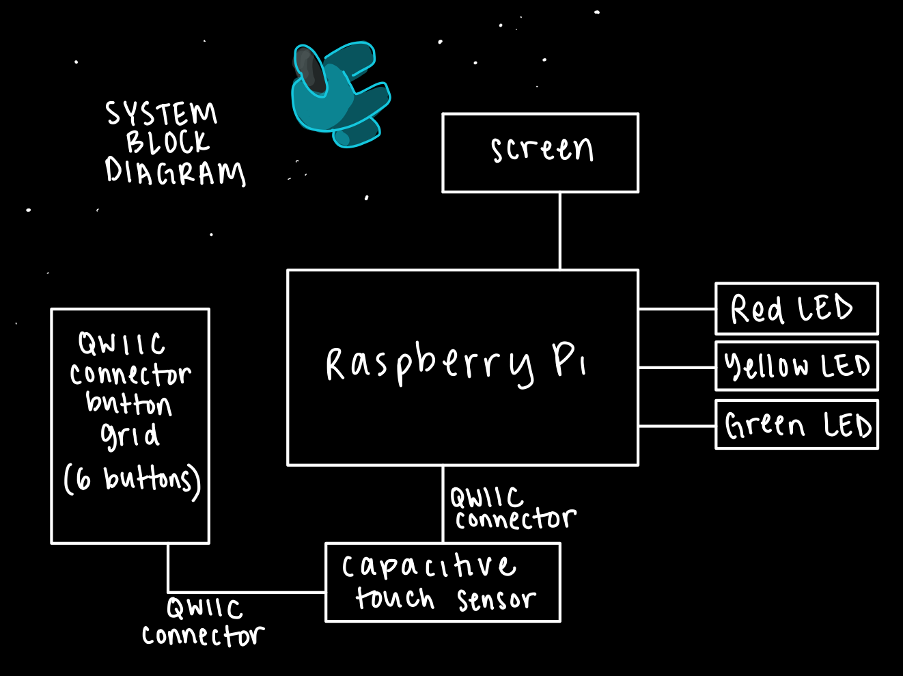
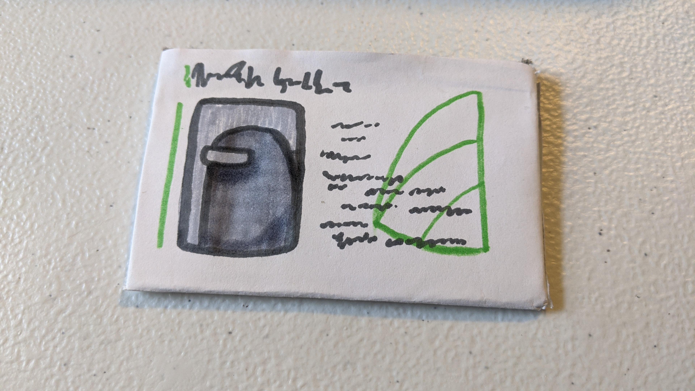

# Final Project

Using the tools and techniques you learned in this class, design, prototype and test an interactive device.

Functional check-off - May 10

Final Project Presentations (video watch party) - May 12

## Objective
The goal of this final project is for you to have a fully functioning and well-designed interactive device of your own design.
 
## Description
Your project is to design and build an interactive device to suit a specific application of your choosing. 

## Deliverables
1. Documentation of design process
2. Archive of all code, design patterns, etc. used in the final design. (As with labs, the standard should be that the documentation would allow you to recreate your project if you woke up with amnesia.)
3. Video of someone using your project (or as safe a version of that as can be managed given social distancing)
4. Reflections on process (What have you learned or wish you knew at the start?)

## Teams
You can and are not required to work in teams. Be clear in documentation who contributed what. The total project contributions should reflect the number of people on the project.

## Examples
[Here is a list of good final projects from previous classes.](https://github.com/FAR-Lab/Developing-and-Designing-Interactive-Devices/wiki/Previous-Final-Projects)
This version of the class is very different, but it may be useful to see these.

# AMIDST US: Spaceship Task Simulator
By Priya Kattappurath, Caitlin Stanton, and Grace Tan

> ## Documentation of Design Process
> ### Motivation + Design Process
> Inspired by the game *Among Us*, we wanted to create a real-life task simulator. Originally, we wanted to do a full recreation of *Among Us*, complete with multiplayer functionality and imposters, but with the time and hardware available to us, we decided to focus on the crewmate task portion of the game. At this point, we went through all the tasks in the game and brainstormed how each of them could be implemented with our available hardware components. Then, with our time constraint in mind, we chose our favorites to be implemented, which we will elaborate on more in the following sections.
>
> ### High-Level Task Overview
> #### Wires
> In this task, wires are connected in a color-defined configuration in order to light up the respective LEDs. This is inspired by the “Fix Wiring” task in *Among Us*, which is essentially the same thing.
>
> 
> #### Card Swipe
> In this task, the player swipes a conductive-fabric-wrapped card along a capacitive touch sensor for a certain amount of time to mimic the “Swipe Card” task. SImilar to the original task, if the user swipes too quickly or too slowly, they will need to repeat the task.
>
> 
> #### Keypad Pattern
> Inspired by the “Start Reactor” task, this consists of several buttons that will blink in a pattern that the player mimics. The pattern appends in length at each stage until they reach the final pattern.
>
> 
>
> ### Honorable Mentions for Tasks
> Here are more tasks that we had come up with during our brainstorming process. While these would have been fun to include, we kept our time constraint in mind, and also noted that these tasks were not as similar to the original tasks as the ones we ultimately chose. 
> #### Engine Alignment 
> The user would move the potentiometer until it reached a certain measurement. Inspired by the “Align Engine Output” task, which requires the player to line up a dial with a line on the screen.
>
> 
> #### Clear out the Dumpster
> In this task, which is inspired by ”Empty Garbage”, the player would hold down the joystick (acting as the trash shoot lever), for a number of seconds.
>
> 
> #### “Medical” Scan
> inspired by the “Submit Scan” task, would consist of the game asking the player to hold up a certain amount of fingers, and using the camera to scan and check if the correct number of fingers are held up. This is not very similar to the original task, which requires no interaction from the player.
>
> 
>
>
> ## Archive of Code, Design Process, etc. for Final Design 
> In this section we will go over how the overall system is set up to make the game playable, and how the hardware and software components are set up for each individual task.
>
> ### Overall System and Display
> #### Hardware
> Below is an overview of the hardware for this system, which we will elaborate upon in more detail in the task specific sections.
>
> 
>
>  We wanted all the hardware components to fit in a compact, easy to transport game box. We imagine this can be brought to be played in the car, on the bus, on a plane, or anywhere people are waiting.  Thus, everything needed to interact with the game can be mounted in the frame of the box, and the lid provides additional minimalist free space. We found a box that fit all the components comfortably without too much excess space.  This size was perfect since it is smaller than the average laptop, which is good for portability.  The Raspberry Pi that is exposed has no use for the game so for aesthetics, we covered it with a sign that says the name of our game.  This game box, in other words “The Skeld,” one of the locations in the *Among Us* game, is shown below.
>
> 
>
We also cut a hole in the game box for seamless power integration, as shown in this side view of the game. 
>
> 
>
>Originally we wanted to make the box fully untethered by adding the file to .bashrc, so the game would start without being connected to a laptop, but this did not work.
> #### Software
> 
>
> ### Wires
> #### Hardware
> ##### Parts List
> - Breadboard
> - Wires
> - Jumper Cables
> - LEDs
> ##### Setup
> To set up this task, the three different colored LEDs are placed across the middle divider of the bread board. The negative side (shorter end) of each LED is connected to the GND line of the breadboard, which is connected to the common ground of the Raspberry Pi. The power line of the breadboard is connected to the 3.3V line. For each LED, a jumper wire is attached at one end to 3.3V power, and the other end is left detached-- in game, the player will connect this to the positive end of the respective LED to turn it on. All wires and jumper cables are color coded to the color of each LED so the player knows which jumper cable to attach to which LED. 3 additional wires connect the positive end of each LED to GPIO5, GPIO6, and GPIO13 on the Raspberry Pi. When all wires are connected (and all LEDs are on), these GPIO pins will all read HIGH, and signal that the task has been completed. 
>
>
> #### Software ([code](https://github.com/caitlinstanton/Interactive-Lab-Hub/blob/Spring2021/Final%20Project/wires.py))
> As each of the wiring is connected in parallel and corresponds to its respective GPIO pin, we check whether the values are high, which means that the wire has been properly connected.  To make this easier, we created boolean variables that represent each of the colored wires: green, red, and yellow.  We also made sure to call <GPIO.cleanup()> at the end.  We initially had a bug and found out that we originally had pull up instead of pull down.  This is wrong because we wanted to read when all values are high.
>
> ### Card Swipe
> #### Hardware
> ##### Parts List
> - Capacitive touch sensor
> - Conductive Tape
> - 1 QWIIC Connector
> - Conductive Fabric
> - Card-sized piece of cardboard
> - Markers to decorate
> ##### Setup
> For the actual card, we used two pieces of cardboard, since only one piece of cardboard was not thick enough for the capacitive touch sensor to detect the card.  On the top side of the card, a piece of capacitive fabric is adhered (this is the side that the player will “swipe” onto the capacitive touch sensor).  This was also decorated with marker as the card in the game is decorated, as shown below.
>
> 
>
> In order to do a capacitive touch sensor, a strip of copper tape is taped onto the frame of the game board. This provides a flat surface to swipe the card on. One end of the copper tape is connected to a pin on the capacitive touch sensor, which is connected to the Raspberry Pi via QWIIC connector as shown below.
>
> 
>
> #### Software ([code](https://github.com/caitlinstanton/Interactive-Lab-Hub/blob/Spring2021/Final%20Project/cardswipe.py))
> In the *Among Us* game, players find difficulty in having to swipe the card at the right speed.  The task will not be completed if the player swipes too slowly or too quickly.  By using the capacitive touch sensor, we are able to see what the value if the card touches it or not, meaning if it's high or not respectively.  [Here](https://drive.google.com/file/d/1ikEmYBMfXzu8OYsWHdutW9wnDvSrpVLA/view?usp=sharing) is test showing how the card with a piece of conductive fabric is being sensed when placed on the capcitive tape.
>
> We decided to implement this aspect of the game into our simulator so we ensured that the task would only be completed if the card was swiped between 1 and 3 seconds.  If the card swipe was not between 1 and 3 seconds, the player will stay in the loop.
>
> Originally, the datetime library was used since that was used in an earlier lab.  However, after realizing that we only needed to keep track of time and this library made lots of unnecessary objects since it also stored the date, we decided to use '''time.perf_counter()''' to track the swipe time, which is done by checking the value of the capacitive touch.  The first time it is touched, that is the '''start_time''' and after the card is no longer touching, '''time.perf_counter()''' is called and stored into '''end_time'''.  The difference of these two variables is the amount of time the card touched the capacitive tape and the task will only be complete if that difference falls between 1 and 3 seconds.
>
> Another error we experienced was due to syntax.  Using an equals sign instead of minus sign did not throw an error but started setting variables to weird values.
>
> ### Keypad Pattern
> #### Hardware
>Need to set different i2c addresses for each (use I2C_scan to check and change_i2c)
Install https://pypi.org/project/sparkfun-qwiic-i2c/ and https://pypi.org/project/sparkfun-qwiic-button/ 
0x6f, 0x5f, 0x4f, 0x3f, <skipped 0x2f for green button>, 0x1f
Accidentally changed wrong I2C address so had to call my_button = qwiic_button.QwiicButton(<I2C>) with an address (rather than empty parens, which defaults to 0x6f) so program would recognize button
Original code: results shown below: 
>
>Error that we solved: we had the i2c addresses in quotes, and was being read as a string instead of integers. Previous error (about dictionary) was because of this as well
>
>Python docs hard to find: https://qwiic-button-py.readthedocs.io/en/main/apiref.html and https://github.com/sparkfun/Qwiic_Button_Py 
>
> ##### Parts List
> - 6 LED Buttons
> - 6 QWIIC Connectors
> - Empty mochi ice cream container to mount buttons
> ##### Setup
The 6 LED buttons are organized by alternating color for aesthetic effect. The grid of buttons are connected together using QWIIC connectors and mounted onto the frame of the game board. To connect to the Raspberry Pi, an intermediate QWIIC connector connects the button grid to the capacitive touch sensor (which is already QWIIC connected to the Raspberry Pi.)
[picture of button grid]
> #### Software ([code](https://github.com/caitlinstanton/Interactive-Lab-Hub/blob/Spring2021/Final%20Project/simon.py))
> 
>
> ### Display
> ##### Parts List
> - Mini PiTFT screen
> ##### Setup
> For the display, we decided to have a simple interface that mimics the *Among Us* game so that the background is black and the text would be white.  The first screen just indicates which button to press to start the game.  Once the button is pressed, the timer is displayed on the top in bigger font for emphasis.  Similarly to the game, we list of tasks in order.  Originally, we only had bullets, but we realized that having a numbered list would be more clear that these tasks had to be done in order since the *Among Us* game allows any order of completion for tasks.  We followed the game's convention of a green task as complete.  We made the incomplete tasks as red for emphasis.  This is shown below.
>
> 
>
> We also had the idea to warn the player when there are 10 seconds left in the game by having the bakcground flash yellow every other second.  We also decided that the text would be black for this because white on yellow background was rather hard to see.  This is shown below.
>
> 
>
> Once time is up, the game will either display that the player won if all tasks have been complete, or that the player lost if not all tasks are complete.  The player also has the option to restart, which will take the player to the initial screen.  This is whon below.
>
> 
>
> #### Software ([preliminary code](./display.py) and [integrated code](https://github.com/caitlinstanton/Interactive-Lab-Hub/blob/Spring2021/Final%20Project/game.py))
> We used similar code from lab 2 of this class and enabled button B as that is the button being used to start and restart the game.  We also added <sleep(.5)> for a delay to minimize debouncing.  The black background and corresponding text, colors, and locations would be displayed.  However, for the last 10 seconds of the game, which would be checked with a condition of whether time left was less than 10, we made sure to make the background yellow if it was an even value of <time.time()> so that it would blink yellow every other second.  We also made sure to change the white text to black for this.
>
> When integrating the display code with the game code, we found that it was difficult to display the order due to how we randomize the order of tasks so it was not fixed.  Thus, we would do a check for every state in the game to see which task corresponded to which order and displayed this order accordingly and it worked. 
>
>
>## Video of our project (including someone using our project)
> Video linked here
>
>
> ## Reflections on Process
>  Overall, we had a lot of fun recreating this game in real life. We were able to explore various aspects of interactive devices in a sleek game format. If we were to remake this project in the future, we would opt for a different connection method rather than QWIIC connectors. While these connectors are “quick” for prototyping, we found that the connections were unreliable, and the I2C were constantly disconnecting. 
>
> We also found that there were multiple ways to implement the sensors for each task, and went through a lot of user testing and iterating to decide which implementation would work the best. For example, for the capacitive touch for the card swipe task, we considered using multiple capacitive touch pads, and Ilan had brought up multiple connections to different GPIO pins. However, in one of our previous labs [here](https://github.com/caitlinstanton/Interactive-Lab-Hub/tree/Spring2021/Lab%204), we found that having multiple capacitive touch pads were really finicky and the Raspberry Pi had difficulty keeping track of all of them. Thus, we opted for a single capacitive touch pad to simplify the system and ensure it will work as expected. 
>
> Additionally, we found that doing user testing was extremely important since testing out various ways to do the keypad task was helpful in determining if the buttons were blinking too quickly, the card swipe was too easy or difficult, or if the amount of time we give for the game is too much time.  Having multiple users test the system was also helpful since everyone would give feedback with how the interface was and if the directions on the screen were clear enough.
>
> Finally, we experimented with both in-person and virtual meetings. These meeting types allowed us to be flexible with our restricting schedules while we could work together on both hardware and software aspects of the project.
> 
