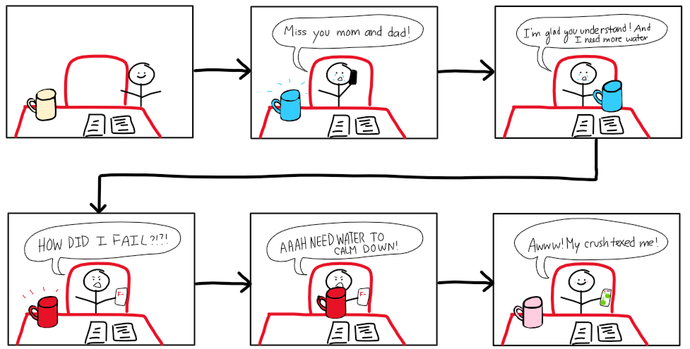
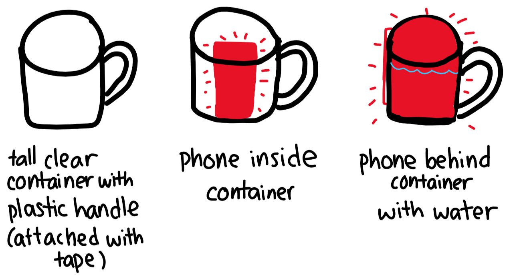
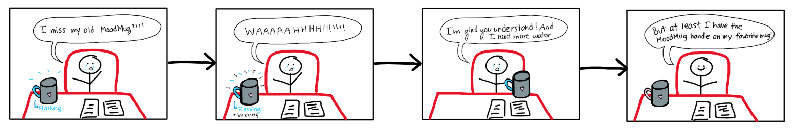
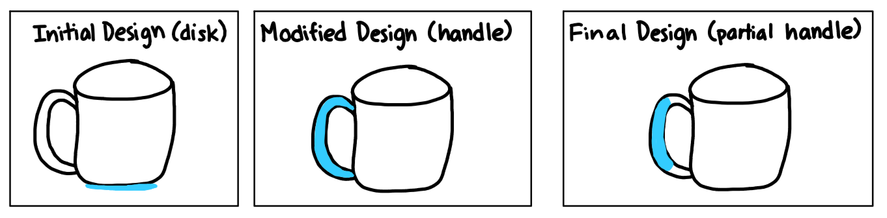

# Staging Interaction

In the original stage production of Peter Pan, Tinker Bell was represented by a darting light created by a small handheld mirror off-stage, reflecting a little circle of light from a powerful lamp. Tinkerbell communicates her presence through this light to the other characters. See more info [here](https://en.wikipedia.org/wiki/Tinker_Bell). 

There is no actor that plays Tinkerbell--her existence in the play comes from the interactions that the other characters have with her.

For lab this week, we draw on this and other inspirations from theatre to stage interactions with a device where the main mode of display/output for the interactive device you are designing is lighting. You will plot the interaction with a storyboard, and use your computer and a smartphone to experiment with what the interactions will look and feel like. _Make sure you read all the instructions and understand the whole of the laboratory activity before starting!_

## Prep

1. Set up [your Github "Lab Hub" repository](../../../) by [following these instructions](https://github.com/FAR-Lab/Developing-and-Designing-Interactive-Devices/blob/2021Spring/readings/Submitting%20Labs.md).
2. Set up the README.md for your Hub repository (for instance, so that it has your name and points to your own Lab 1) and [learn how](https://guides.github.com/features/mastering-markdown/) to post links to your submissions on your readme.md so we can find them easily.

### For lab, you will need:

1. Paper
1. Markers/ Pen
1. Smart Phone--Main required feature is that the phone needs to have a browser and display a webpage.
1. Computer--we will use your computer to host a webpage which also features controls
1. Found objects and materials--you’ll have to costume your phone so that it looks like some other device. These materials can include doll clothes, a paper lantern, a bottle, human clothes, a pillow case. Be creative!
1. Scissors

### Deliverables for this lab are: 
1. Storyboard
1. Sketches/photos of costumed device
1. Any reflections you have on the process.
1. Video sketch of the prototyped interaction.
1. Submit these in the lab1 folder of your class [Github page], either as links or uploaded files. Each group member should post their own copy of the work to their own Lab Hub, even if some of the work is the same for each person in the group.

## Overview
For this assignment, you are going to 

A) [Plan](#part-a-plan) 

B) [Act out the interaction](#part-b-act-out-the-interaction) 

C) [Prototype the device](#part-c-prototype-the-device)

D) [Wizard the device](#part-d-wizard-the-device) 

E) [Costume the device](#part-e-costume-the-device)

F) [Record the interaction](#part-f-record)

## The Report
This readme.md page in your own repository should be edited to include the work you have done. You can delete everything but the headers and the sections between the **stars**. Write the answers to the questions under the starred sentences. Include any material that explains what you did in this lab hub folder, and link it in the readme.

Labs are due on Mondays. Make sure this page is linked to on your main class hub page.

## Part A. Plan 

To stage the interaction with your interactive device, think about:

_Setting:_ Where is this interaction happening? (e.g., a jungle, the kitchen) When is it happening?

_Players:_ Who is involved in the interaction? Who else is there? If you reflect on the design of current day interactive devices like the Amazon Alexa, it’s clear they didn’t take into account people who had roommates, or the presence of children. Think through all the people who are in the setting.

_Activity:_ What is happening between the actors?

_Goals:_ What are the goals of each player? (e.g., jumping to a tree, opening the fridge). 

The interactive device can be anything *except* a computer, a tablet computer or a smart phone, but the main way it interacts needs to be using light.
**Describe your setting, players, activity and goals here.**

> The setting is someone's desk.
>
> The players are comprised of a person and a color changing mug, called the MoodMug.
>
> The activity is that based on the emotions the person is experiencing, the mug changes color to match the person's mood.  For example, if the person is sad, angry, or in love, the mug thurns blue, red, and pink respectively.  When the person is not at his or her desk, the mug is a neutral beige color.
>
> The goal is for the person to live a hydrated lifestyle while having some companionship at their desk (especially since there is no one at the office nowadays due to work from home culture).  With the mug changing color, the person can feel validated when he or she is experiencing a rollercoaster of emotions.  As the mug changes color, the person is also reminded to drink water, allowing them to also handle their emotions well.

Sketch a storyboard of the interactions you are planning. It does not need to be perfect, but must get across the behavior of the interactive device and the other characters in the scene. 
**Include a picture of your storyboard here**

> 

Present your idea to the other people in your breakout room. You can just get feedback from one another or you can work together on the other parts of the lab.
**Summarize feedback you got here.**
> With my idea of turning this color changing object into a mug, Sal said that we can put a piece of thin paper over the light to make it look better.  Alan suggested using sounds, such as bubbling to make the interaction more engaging not just visually.  

## Part B. Act out the Interaction

Try physically acting out the interaction you planned. For now, you can just pretend the device is doing the things you’ve scripted for it. 

**Are there things that seemed better on paper than acted out?**
> Just having the color change would not be as noticeable unless the mug was directly in front of the person.  When I was acting it out, the mug was on the side of the table.

**Are there new ideas that occur to you or your collaborators that come up from the acting?**
> Alan came up with the idea that as the object is changing color, the object is also playing music that is related to the emotion.  That way, the changing color is also more noticeable.  
>
> I also thought of the idea of adding more to the interaction between the mug and person.  The mug can also blink or flash shades of the respective color, to indicate that the person should drink more water.  If it doesn't flash, then the person is hydrated enough.

## Part C. Prototype the device

You will be using your smartphone as a stand-in for the device you are prototyping. You will use the browser of your smart phone to act as a “light” and use a remote control interface to remotely change the light on that device. 

Code for the "Tinkerbelle" tool, and instructions for setting up the server and your phone are [here](https://github.com/FAR-Lab/tinkerbelle).

We invented this tool for this lab! 
**Give us feedback on Tinkerbelle.**
> I think that Tinkerbelle does a pretty good job and I like how you can easily control it from the computer and project it on the phone since it makes it easier to prototype.  It is also very simple to use!  
> I think it would be beneficial if there is an option to fade into another color when you select from one color to another instead of manually sliding the color bar.  I thought this would give my prototype smoother transitions as it goes from one color to another.

## Part D. Wizard the device
Take a little time to set up the wizarding set-up that allows for someone to remotely control the device while someone acts with it. Hint: You can use Zoom to record videos, and you can pin someone’s video feed if that is the scene which you want to record. 

**Include your first attempts at recording the set-up video here.**

> [Setup: ](https://drive.google.com/file/d/1qcjL0XvxY_wQjxNLHKbQdlJ4N4EOsEpV/view?usp=sharing) This attempt shows how tinkerbelle is being controlled remotely using a wireless mouse and the color change can be visible while recording as the phone is being propped up.  Since this is the intial test for the setup, there was no interaction between the person and the device as I wanted to make sure the device could change color.
>
> [First Type of Interaction: ](https://drive.google.com/file/d/1BFQv1Tecd8sAP_El4dD6OGfVWi0sh6-9/view?usp=sharing) This interaction is having the color change based on the person's mood.  The person's mood is expressed through their feelings as they are explaining about different events happening in their lives.

Now, change the goal within the same setting, and update the interaction with the paper prototype. 

**Show the follow-up work here.**
> [Second Type of Interaction: ](https://drive.google.com/file/d/1UGrD8xygJkbXcb7_1NIU_a1KtNizHmR2/view?usp=sharing) This interaction is still at the person's desk and the color change is based on the person's mood.  However, the interaction also involves encouraging the person to stay hydrated and so the intensity of the color changes so it looks like it is flashing.  This gets the person's interaction and prompts the person to take a drink.

## Part E. Costume the device

Only now should you start worrying about what the device should look like. Develop a costume so that you can use your phone as this device.

Think about the setting of the device: is the environment a place where the device could overheat? Is water a danger? Does it need to have bright colors in an emergency setting?

**Include sketches of what your device might look like here.**

> 

**What concerns or opportunitities are influencing the way you've designed the device to look?**

> Every person's office desk has a mug since it is important to stay hydrated throughout the day.  Similar to "mood rings", this device can be called a MoodMug.  A mug should be shaped as a cylinder with an opening at the top with a nice handle.  Since this mug is color changing, it should not be opaque but transparent so that the color changing from the phone can be seen through the cylindrical container.  The handle can have a similar transluscent effect as the container by using some clera plastic.  In order to make it look like the whole mug is changing color, water can be put inside the cylindrical container while the phone is placed right behind it.  That way, the colored light is shone through the water so the entire mug looks like it is changing color.
>
> A concern despite all these opportunities is getting the phone wet because there is water that can spill.  Instead of the person holding the mug solely using the handle, the person can carry the mug by using both hands around the container.  Additionally, the container shouldn't be filled with water all the way to avoid any spillage.

## Part F. Record

**Take a video of your prototyped interaction.**
> [Prototyped Interaction: ](https://drive.google.com/file/d/1vw0BBLqURjqqueMAnbpgEl_tYy2q9FSL/view?usp=sharing) This is the prototyped interaction where the person comes to her office and is first saddened that she cannot spend Chinese New Year with her parents.  The mug changes from a neutral to blue color and then blinks, reminding the person to drink water.  The person discovers her bad grade from an assignment, and the mug turns into a red color to empathize, and also blinks to remind the person to hydrate.  The blinking stops after the person drinks enough water.  When the person discovers she has a date to spend the new year with, she is blushing and the mug reflects that.  The mug no longer blinks since she has already consumed enough water.
>
> This final recording of the interaction between the person and device is based off the original storyboard but has an added theme of Chinese New Year.  This happened because as I continued to act out my interaction with this device as if it was my own, I was myself, not just a person acting out an interaction with the device.  Thus, I was able to construct a story that is more relevant and not just forced.  This helped even more with designing how the mug should change color and flash to remind me to drink water.

**Please indicate anyone you collaborated with on this Lab.**
Be generous in acknowledging their contributions! And also recognizing any other influences (e.g. from YouTube, Github, Twitter) that informed your design. 
> I had the idea of a color changing object because Alan mentioned a color changing cuttlefish.  These cuttlefish changed color based on their environment.  Sal proposed the idea of how to diffuse the light better and that is where I got the idea to use water instead of thin paper or tissue paper since I did not have those materials at my home.

# Staging Interaction, Part 2 

This describes the second week's work for this lab activity.

## Prep (to be done before Lab on Wednesday)

You will be assigned three partners from another group. Go to their github pages, view their videos, and provide them with reactions, suggestions & feedback: explain to them what you saw happening in their video. Guess the scene and the goals of the character. Ask them about anything that wasn’t clear. 

**Summarize feedback from your partners here.**

> Everyone I talked to really enjoyed my prototype that was aesthetically pleasing as well as the dual functionality of having a companion that empathizes with your mood as well as a reminder to drink water.  Bebe said that I can provide more voice interaction to provide more comfort.  Priya suggested that it would be cool to extend this device so that it can also be used to water plants.  Sujith suggested also having a tracker so it displays how much water the person has consumed.  Andrew mentioned that using some audio or other sounds can also enhance the user interaction with the device.

## Make it your own

Do last week’s assignment again, but this time: 
1) It doesn’t have to (just) use light, 
2) You can use any modality (e.g., vibration, sound) to prototype the behaviors, 
3) We will be grading with an emphasis on creativity. 

**Document everything here.**

### Plan
> After getting great feedback from other students, it would be nice to build on the idea I started from last week.  Since some people have a favorite mug that they already used, I thought it would not be sustainable for them to no longer use that mug and get a MoodMug just to enjoy this feature.  I decided to modify this MoodMug into an accessory that can be attached to any mug or really any beverage container.  Thus, the setting, players, activity, and goals are still very similar with the addition of having vibrations
>
> The setting is someone's desk.
> The players are comprised of a person and a color changing MoodMug accessory.
> The activity is that based on the emotions the person is experiencing, the MoodMug accessory changes color to match the person's mood. For example, if the person is sad or very touched, the MoodMug accesory turns blue or pink respectively, empathizing with the person. 
> The second goal is to keep the person hydrated.  Whenever the the person should drink water, the MoodMug accesory will flash.  If the person does not drink even after flashing, the accessory will vibrate.  This will grab the person's attention if they did not notice the visual cues, which can happen if they are focused on another activity on their desk, such as work.
>
> Below is a storyboard for this new device:
>  
> 

### Prototype the Device
> Since the goal of this accessory is to allow the user to continue using their favorite mug, I did not want to cover the mug's main design so this accessory could not be a sleeve that would wrap around it.  Below are the different sketches I came up with.
> 
> 
> 
> The first design was a disk to attach at the bottom of the mug, as suggested by Caitlin.  However, many mugs are opaque and the very thin lining at the bottom would not bring as much attention.  Thus, I changed the design to only have the handle change different colors, since majority of mugs have plain handles.  However, many mugs have different types of curves that would make it hard to manufacture an accessory that can easily fit any mug handle.  With this in mind, my final design consists of only part of the handle being covered with the accessory.  That way, this accessory is like a strap that can be easily attached and adjusted to any mug handle.

### Costume the Device and Record the Interaction
> To costume the device, I used tin foil to act as the accessory.  I cut a strip and wrapped it around my mug handle.  By placing it in front of the Tinkerbelle color changing screen, the reflective properties from the tin foil will make it look like the handle accessory is changing.  
>
> [Prototype Interaction:](https://drive.google.com/file/d/14BjKpWOnsErzb6d9Zc4ojP_A0GEVWfEa/view?usp=sharing).  The user is sad that her MoodMug has disappeared and so the handle turns blue.  It also starts flashing to remind the user to drink water.  When the user ignores the flashing, there are vibrations from the handle and so the user drinks water.  As the user is reminded of this new MoodMug accessory, she is in love with it and the handle turns pink.  Again, the handle flashes and vibrates to remind the user to stay hydrated.

### Reflection
> I really appreciate all the classmates that gave me feedback as this idea finally developed into this MoodMug handle accessory.  I am pleasantly surprised by what could happen in a week.  I realized that once I made this problem personal and more applicable to my own life, it was easier to craft a solution that made more sense versus with the goal of trying to come up with an interactive device for an assignment.  This was especially helpful for part 2 since I really like my mug and would not buy another one to replace it.  However, in order to have this feature, I would purchase a strap to go around the handle and it does not bother with the aesthetics of the mug, only enhancing it.
