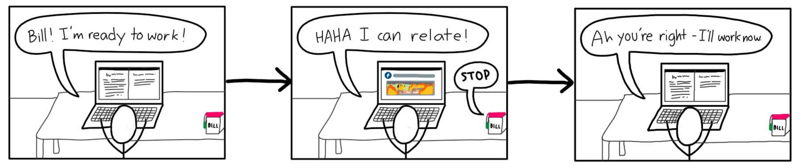
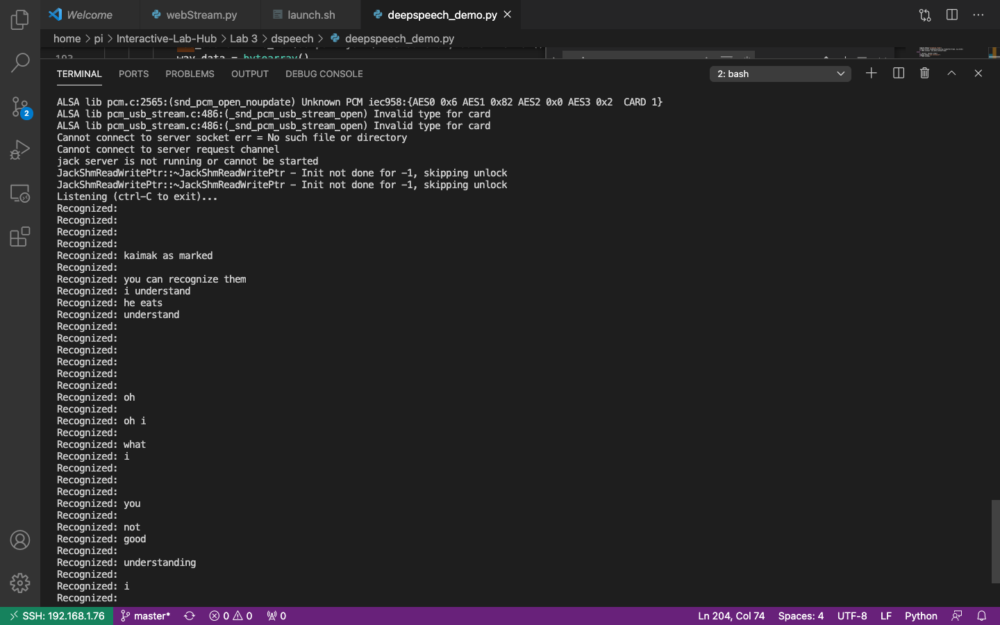
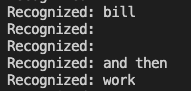
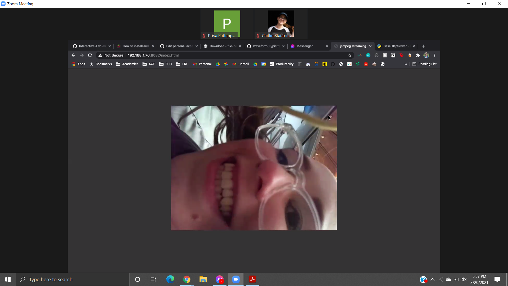
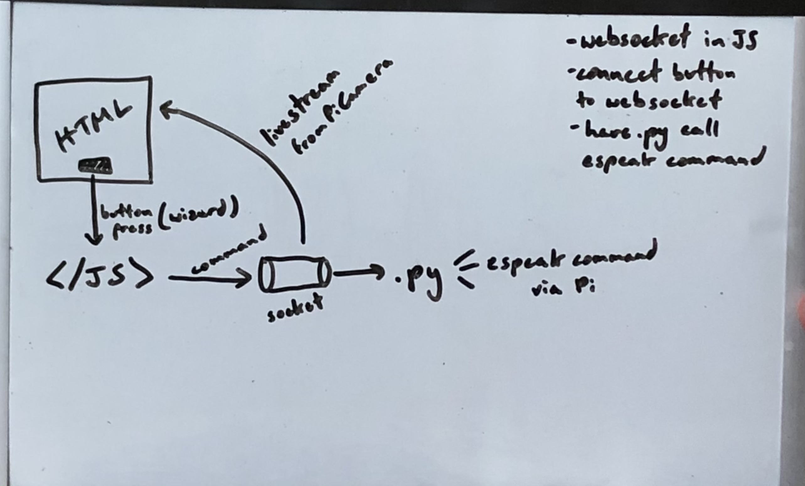

# You're a wizard, Grace


In this lab, we want you to practice wizarding an interactive device as discussed in class. We will focus on audio as the main modality for interaction but there is no reason these general techniques can't extend to video, haptics or other interactive mechanisms. In fact, you are welcome to add those to your project if they enhance your design.


## Text to Speech and Speech to Text

In the home directory of your Pi there is a folder called `text2speech` containing some shell scripts.

```
pi@ixe00:~/text2speech $ ls
Download        festival_demo.sh  GoogleTTS_demo.sh  pico2text_demo.sh
espeak_demo.sh  flite_demo.sh     lookdave.wav

```

you can run these examples by typing 
`./espeakdeom.sh`. Take some time to look at each script and see how it works. You can see a script by typing `cat filename`

```
pi@ixe00:~/text2speech $ cat festival_demo.sh 
#from: https://elinux.org/RPi_Text_to_Speech_(Speech_Synthesis)#Festival_Text_to_Speech

echo "Just what do you think you're doing, Dave?" | festival --tts

```

You can also play audio files directly with `aplay filename`.

After looking through this folder do the same for the `speech2text` folder. In particular, look at `test_words.py` and make sure you understand how the vocab is defined. Then try `./vosk_demo_mic.sh`

## Serving Pages

In Lab 1 we served a webpage with flask. In this lab you may find it useful to serve a webpage for the controller on a remote device. Here is a simple example of a webserver.

```
pi@ixe00:~/$ python server.py
 * Serving Flask app "server" (lazy loading)
 * Environment: production
   WARNING: This is a development server. Do not use it in a production deployment.
   Use a production WSGI server instead.
 * Debug mode: on
 * Running on http://0.0.0.0:5000/ (Press CTRL+C to quit)
 * Restarting with stat
 * Debugger is active!
 * Debugger PIN: 162-573-883
```
From a remote browser on the same network, check to make sure your webserver is working by going to [http://ixe00.local:5000]()


## Demo

In the [demo directory](./demo), you will find an example wizard of oz project you may use as a template. **You do not have to** feel free to get creative. In that project, you can see how audio and sensor data is streamed from the Pi to a wizard controller that runs in the browser. You can control what system says from the controller as well.

## Optional

There is an included [dspeech](.dspeech) demo that uses [Mozilla DeepSpeech](https://github.com/mozilla/DeepSpeech) for speech to text. If you're interested in trying it out we suggest you create a seperarate virutalenv. 


# Lab 3 Part 2

Create a system that runs on the Raspberry Pi that takes in one or more sensors and requires participants to speak to it. Document how the system works and include videos of both the system and the controller.

## Prep for Part 2

1. Sketch ideas for what you'll work on in lab on Wednesday.

>### System Idea
>
>Our system is inspired by our own lives, as when we try to do work, we often find ourselves procrastinating.  What if there was a system that would remind us to not procrastinate so that we could work when we are supposed to?
>
>We have come up with “Bill,” an accountable friend who helps the user not procrastinate.  Whenever the user is not doing work, Bill will remind the user to do it.  This system will have a Picamera so that the Wizard can see whether the user is doing work or not via a livestream and talk to prompt the user to do work.  

>### Storyboard
>
>Below is the storyboard, which we will explain each picture in detail below.
>
> 
>
>The first picture shows how Bill will initialize.  Dspeech will always be running to listen to the user.  When the user says “Bill,” the Picamera will turn on and the camera live stream will start.  This is similar to when people are used to interacting with their Google Home and say “Hey Google” or their AmazonAlexa and say “Alexa.”  We chose “Bill” for the name instead of a device name such as “Anti-Procrastinator” because users will feel more comfortable talking to a person as they are doing their work (or procrastinating).  Additionally, after the user says “I will start work,” espeak will turn on so the Wizard can start to tell the user to go back to work if the user procrastinates.
>
>The second picture shows the user procrastinating by seeing a meme on facebook and as Bill sees and hears this, Bill will say, “STOP.”
>
> The third picture shows how the user is reminded of going back to work, and so his laptop screen goes back to all the documents that need to be worked on.
>

## Share your idea sketches with Zoom Room mates and get feedback

*what was the feedback? Who did it come from?*

## Prototype your system

The system should:
* use the Raspberry Pi 
* use one or more sensors
* require participants to speak to it. 

*Document how the system works*

*Include videos or screencaptures of both the system and the controller.*

>### Finite State Machine of Functionality
> 
>Below is an outline of a finite state machine, detailing how the user will interact with Bill.  Bill uses dspeech to recognize the user say certain trigger words and phrases.  Bill will also use the Picamera livestream to monitor the user.  Whenever Bill wants to talk, Bill will use espeak and have an LED flash.
>
> 
>
>### Implementing Bill
>
>Overall, we tried to integrate incrementally in order to create this wizard.  All our code is in WizardingDemo.py. 
>
>We first went through the various demos provided as a team.  When testing out dspeech (or deepspeech), we saw that having our masks on made it difficult for the microphone to pick up everything we were saying.  Even with our masks off, it was not perfect.  Below is a screenshot that shows how dspeech had a hard time capturing entire sentences.  
>
> 
>
>Due to this, we decided to only use trigger words or trigger phrases to turn Bill on or have Bill watch the user, such as "Bill" and "work" respectively. Here is a screenshot that shows how the system reocgnized these trigger words in a sentence:
>
>
>
>The next portion we focused on was how to monitor the user.  We decided to integrate the Pi camera with our system so that we can have a livestream of the user.  We first tried using [web streaming](https://picamera.readthedocs.io/en/release-1.13/recipes2.html#web-streaming) to start a livestream.  However, after we rebooted the Pi and played around with dspeech, the web streaming module was not working for some reason.  After some research, we decided to try [pistreaming](https://github.com/waveform80/pistreaming/) and it worked.  Additionally, it worked even better than web streaming since it has lower latency. Here is a picture of how we tested the live stream:
> 
>
>After trying to integrate the code related to the server and dspeech, we were getting an error at this line:
>
```
#self.send_header('Last-Modified', self.date_time_string(time()))
```
>
>However, when we commented the following line of code, it worked and we were able to start the livestream after “Bill” is recognized.
>
>After trying to integrate espeak, we were getting errors.  We needed to figure out how to use websocket in JavaScript and connect the button to the websocket, and have the python file call the espeak command. Below is some brainstorming with diagrams we drew out to make sure we understood the problem:
>
>
>
>After realizing that there was some other program running on that particular port, we were able to kill that program, and we were able to integrate espeek.  
>
>Afterwards, we encountered the following error:
>
```
WARNING:root:Removed streaming client ('192.168.1.6', 49544): name 'output' is not defined
```
>
>This is because the output had to be global, as described in this [link](https://raspberrypi.stackexchange.com/questions/99756/cannot-turn-web-streaming-into-a-function).
>
>Next, we were still having issues with using espeak because the value from the button was not being obtained properly with python.  We saw that there is a simple way to do this with flask.  By wanting to use flask for this, we also tried using the Picamera with flask.  However, we ran into an issue where this started to not work either.  Finally, after reading this [link](https://github.com/waveform80/picamera/issues/488), we learned that something else was using the Picamera so after a reboot, everything was working again.
>
>### Finishing Touches
>
>For the purposes of wizarding, there’s a UI button with a connected text box that the wizard can type a phrase to speak to the user. Once everything had been integrated into a Flask application, we had to figure out GET/POST requests with Ajax to send over the words inputted in that text box. This [StackOverflow post](https://stackoverflow.com/questions/29987323/how-do-i-send-data-from-js-to-python-with-flask/29988302#:~:text=To%20get%20data%20from%20Javascript,get%20it%20in%20different%20ways.) and [other StackOverflow post](https://stackoverflow.com/questions/42601478/flask-calling-python-function-on-button-onclick-event) were both extremely helpful in helping us write index.js. We ran into the error:

```
json flask NameError: name 'request' is not defined
```

>We had forgotten to add “from flask import request” at the top of app.py, as specified in [this post](https://stackoverflow.com/questions/41487473/nameerror-name-request-is-not-defined). 
>
>After these fixes, the wizard was able to output speech to the user based on what was typed in the text box. However, this error kept popping up in the terminal after “espeak” had been called:
```
TypeError: The view function did not return a valid response. 
```
>Though this didn’t impair the functionality of Bill, we wanted to make sure that all of our loose ends were tied up. [This post](https://stackoverflow.com/questions/25034123/flask-value-error-view-function-did-not-return-a-response) told us that the POST request method “handle_speak()” in app.py needed to return either a function or a string, so we adjusted the method accordingly.
>
>To make Bill more presentable, we referenced [this project from ECE 5725](https://courses.ece.cornell.edu/ece5990/ECE5725_Spring2020_Projects/May_15_Demo/Smart%20Home%20Security/ak754_tss86_Monday/index.html#results) for their HTML and CSS formatting.
>
>For more visual stimuli, a green LED (connected to an I2C button) flares brightly when Bill is speaking with the user. We favored green over red in order to make Bill seem less antagonistic and aggressive.
>
> ### Bill Demo
>The video of our demo can be found [here](https://www.youtube.com/watch?v=49yfEAA9jR0).

## Test the system
Try to get at least two people to interact with your system. (Ideally, you would inform them that there is a wizard _after_ the interaction, but we recognize that can be hard.)

>Caitlin's housemate, Michael, was able to test out the system.  He has some technical experience and already knew that there was probably wizarding involved since he reasoned that there is a lack of image processing or a computer vision library and with only using a web socket, there wouldn't be enough resources to determine facial resources.  However, he thought that monitoring the system was great! He said it was really convenient to not have to click on anything and Bill just starts and stops due to voice activated integration. 

Answer the following:

### What worked well about the system and what didn't?
>It is very convenient overall since the user can just use his or her voice to turn Bill on and off.  Many apps on the phone or programs require clicking or tapping, and sometimes, the user forgets to do so.  From the user perspective, it may be creepy that Bill is always watching them (Michale mentioned this) even though we gave Bill a blinking green LED.  Some other feedback was that having the LED turn on while Bill was talking seemed cool, and they wished that the LED would blink when Bill is turning off and on, just like Google Home or Amazon's Alexa. 

### What worked well about the controller and what didn't?
>What worked well was that the controller could easily see the user's face, whether the user was being productive or not.  The controller could also just speak to the user by typing effortlessly on the wonderful UI.  However, the monitoring features were limited since we did not implement the controller's ability to see what websites the user went on, as that could be an easier way to indicate if the user is procrastinating. 

### What lessons can you take away from the WoZ interactions for designing a more autonomous version of the system?
> Our team learned that it is very hard to humanize a device.  Even after naming the device Bill, it seems creepy that this device has a camera that is monitoring your every move, reminding you every single time you procrastinate.  We also learned that there are many benefits with designing such a system, as it is so easy for students to be distracted and no one would be around to remind you constantly like Bill.

### How could you use your system to create a dataset of interaction? What other sensing modalities would make sense to capture?
>The system can monitor the user's facial expressions and eyes using tracking software.  Additionally, having a module that allows the system to monitor the user's screen, or even control it, could help with Bill's functionality to remind them to not procrastiante.  Perhaps, the user can set levels to how much control they want Bill to have on their computer.  Bill could give them verbal reminders or have Bill automatically close tabs after the user spends more than two minutes on a website that is causing distraction.  Some people may want facial recognition, or just Bill's ability to see their computer screen.  Based on what people are comfortable with in what Bill is sensing, they will be more open and willing to interact with Bill, and hopefully actually see him as a friend to help them with their procrastination struggles.

