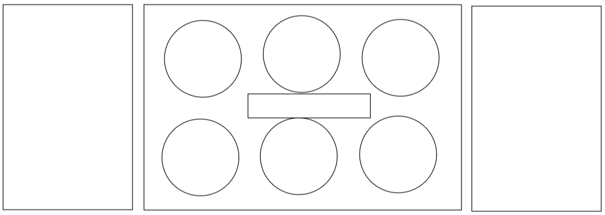
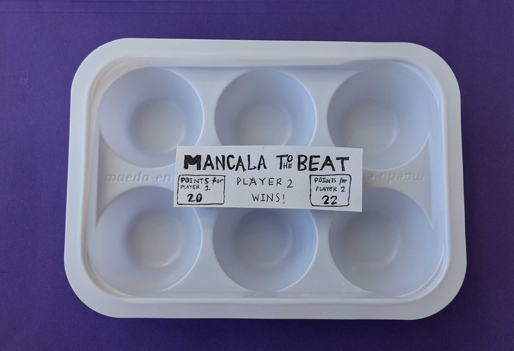
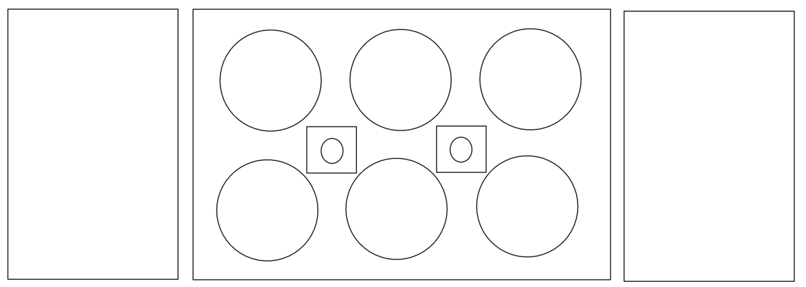
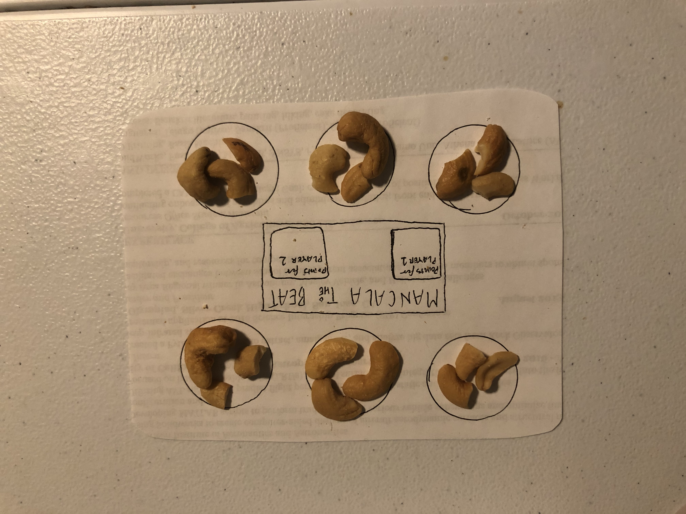
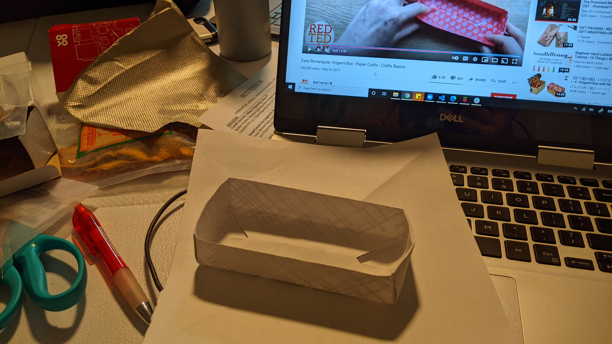
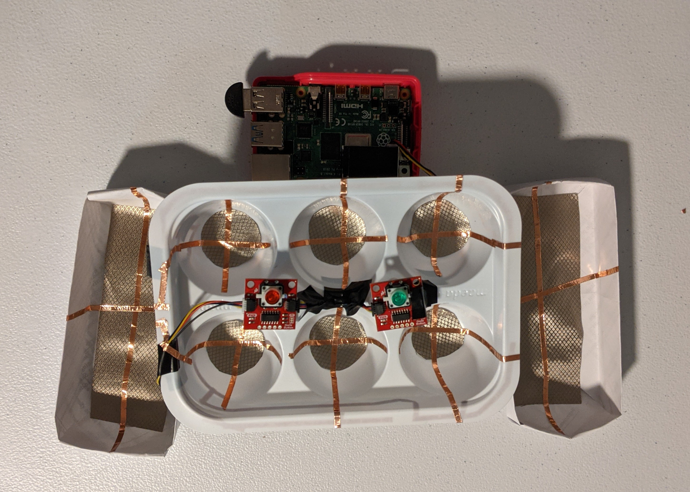

# Ph-UI!!!

For lab this week, we focus on the prototyping the physical look and feel of the device. _Make sure you read all the instructions and understand the whole of the laboratory activity before starting!_


## Prep

1. Pull the new Github Repo.
2. Readings: 

* [What do prototypes prototype?](https://www.semanticscholar.org/paper/What-do-Prototypes-Prototype-Houde-Hill/30bc6125fab9d9b2d5854223aeea7900a218f149)

* [Paper prototyping](https://www.uxpin.com/studio/blog/paper-prototyping-the-practical-beginners-guide/) is used by UX designers to quickly develop interface ideas and run them by people before any programming occurs. 

* [Cardboard prototypes](https://www.youtube.com/watch?v=k_9Q-KDSb9o) help interactive product designers to work through additional issues, like how big something should be, how it could be carried, where it would sit. 

* [Tips to Cut, Fold, Mold and Papier-Mache Cardboard](https://makezine.com/2016/04/21/working-with-cardboard-tips-cut-fold-mold-papier-mache/) from Make Magazine.

* [Surprisingly complicated forms](https://www.pinterest.com/pin/50032245843343100/) can be built with paper, cardstock or cardboard.  The most advanced and challenging prototypes to prototype with paper are [cardboard mechanisms](https://www.pinterest.com/helgangchin/paper-mechanisms/) which move and change. 

 Dyson Vacuum cardboard prototypes


### For lab, you will need:

1. Cardboard (start collecting those shipping boxes!)
1. Cutting board
1. Cutting tools
1. Markers
1. Found objects and materials--like bananas--we're not saying that to be funny.


### Deliverables for this lab are: 
1. Sketches/photos of device designs
1. "Looks like" prototypes: show us what how the device should look, feel, sit, weigh, etc.
3. "Works like" prototypes: show us what the device can do
4. "Acts like" prototypes: videos/storyboards/other means of showing how a person would interact with the device
5. Submit these in the lab 4 folder of your class [Github page], either as links or uploaded files. Each group member should post their own copy of the work to their own Lab Hub, even if some of the work is the same for each person in the group.


## Overview
Here are the parts of the assignment

A) [Capacitive Sensing](#part-a)

B) [OLED screen](#part-b) 

C) [Paper Display](#part-c)

D) [Wizard the device](#part-d-wizard-the-device) 

E) [Costume the device](#part-e-costume-the-device)

F) [Record the interaction](#part-f-record)

## The Report
This readme.md page in your own repository should be edited to include the work you have done. You can delete everything but the headers and the sections between the **stars**. Write the answers to the questions under the starred sentences. 

Include any material that explains what you did in this lab hub folder, and link it in the readme.

Labs are due on Mondays. Make sure this page is linked to on your main class hub page.

### Part A
### Capacitive Sensing, a.k.a. Human Banana Interaction

We wanted to introduce you to the [capacitive sensor](https://learn.adafruit.com/adafruit-mpr121-gator) in your kit. It's one of the most flexible input devices we were able to provide. At boot it measures the capacitance on each of the 12 contacts. Whenever that capacitance changes it considers it a user touch. You can attach any conductive material. In your kit you have conductive fabric and copper tape that will work well, but don't limit yourself! In this lab we will use (go?) bananas!

<p float="left">


</p>

Plug in the capacitive sensor board with the qwiic connector. Connect your banana's with either the copper tape or the alligator clips (the clips work better). make sure to install the requirements from `requirements.txt`


I've connected my banana's* to pads 6 and 10. When you run the code and touch a banana the terminal will print out the following

```
(circuitpython) pi@ixe00:~/Interactive-Lab-Hub/Lab 4 $ python cap_test.py 
Banana 10 touched!
Banana 6 touched!
```

*\*Some students have noted that their banana's look noticeably different from the ones presented in this demo. We firmly reject the accusation that these are not in fact banana's but Twizzlers™. Due to the challenges of remote teaching we cannot debug banana's at this time. We suggest you bring these issues up with the university or your local produce representative*

### Part B
### OLED screen

We just received some of the small oled screens that we had coped to include in your kit. If you want one feel free to pop into the lab and get one. These don't have colors like the one on the pi but you can move it around on a cable making for more flexible interface design. The way you program this display is almost identical to the pi display. Take a look at `oled_test.py` and some more of the [Adafruit examples](https://github.com/adafruit/Adafruit_CircuitPython_SSD1306/tree/master/examples).

<p float="left">


</p>


### Part C
### Paper Display

Here is an Pi with a paper faceplate on it to turn it into a display:


This is fine, but it can be a bit difficult to lay out a great and user friendly display within the constraints of the Pi. Also, it really only works for applications where people can come and stand over the Pi, or where you can mount the Pi to the wall.

Here is another prototype for a paper display:


It holds a pi and usb power supply, and provides a front stage on which to put writing, graphics, LEDs, buttons or displays.

This design can be made by scoring a long strip of corrugated cardboard of width X, with the following measurements:

| Y height of box <br> <sub><sup>- thickness of cardboard</sup></sub> | Z  depth of box <br><sub><sup>- thickness of cardboard</sup></sub> | Y height of box  | Z  depth of box | H height of faceplate <br><sub><sup>* * * * * (don't make this too short) * * * * *</sup></sub>|
| --- | --- | --- | --- | --- | 

Fold the first flap of the strip so that it sits flush against the back of the face plate, and tape, velcro or hot glue it in place. This will make a H x X interface, with a box of Z x X footprint (which you can adapt to the things you want to put in the box) and a height Y in the back. 

Here is an example:


Make a paper display for your project that communicates the state of the Pi and a sensor. Ideally you should design it so that you can slide the Pi out to work on the circuit or programming, and then slide it back in and reattach a few wires to be back in operation.
 
**a. Document the design for your paper display.** (e.g. if you had to make it again from scratch, what information would you need?). Include interim iterations (or at least tell us about them).

**b. Make a video of your paper display in action.**

**c. Explain the rationale for the design.** (e.g. Does it need to be a certain size or form or need to be able to be seen from a certain distance?)

### Part D
### Materiality

**Open Ended**: We are putting very few constraints on this part but we want you to get creative.

Design a system with the Pi and anything from your kit with a focus on form, and materiality. The "stuff" that enclose the system should be informed by the desired interaction. What would a computer made of rocks be like? How would an ipod made of grass behave? Would a roomba made of gold clean your floor any differently?

**a. document the material prototype.** Include candidates that were considered even if they were set aside later.

**b. explain the selection.**

### Deliverables for this lab are:

1. Sketches/photos of device designs
2. "Looks like" prototypes: show us what how the device should look, feel, sit, weigh, etc.
3. "Works like" prototypes: show us what the device can do
4. "Acts like" prototypes: videos/storyboards/other means of showing how a person would interact with the device
5. Submit these in the lab 4 folder of your class [Github page], either as links or uploaded files. Each group member should post their own copy of the work to their own Lab Hub, even if some of the work is the same for each person in the group.

> ### "Looks like"
>
> #### Rationale for Design
> Our design is to bring back nostalgic memories of Mancala boards that fir in a child's lap.  Thus, we decided to make a prototype that models this, having it to be relatively small, light, and ultimately so this game can be brought anywhere.
>
> #### Original Design Idea
> Our original paper display is to show the game "Mancala to the Beat" where the players have to play mancala with the catch of picking up and dropping mancala pieces to the beat of the song.  Each time they do this correctly, they receive a point.  Each time they do not, they lose a point.  Our prototype wil look like a Mancala board that has multiple wells and at the ends, there will be bigger containers to hold the beads.  Below is a sketch where the circles are the wells and the recntalges at the ends are for the bigger containers to hold the beads to keep track of each person's points.  The rectnangle in the middle is the OLED display that will show the beat to the song.  The screen will also display the name of the game, the points for each respective player on the sides of the screen, and any annunciations in the middle such as "Player 1's Turn" or "Player 2 wins!" throughout the game.  
>
> Here is the sketch of our original design idea:
>
> 
>
> Here is part of our original prototype with an unused container with wells that would work well: 
>
> 
>
> #### New Design
> After gathering feedback from others, we decided to change the game slightly so it would be a an "imaginary mancala" because this seemed more fun then just dropping the beads to the beat.  We also realized it would be hard to keep track of all the beads as they are easy to lose and so we will have a display that corresponds to how many beads are in each of the mancala wells. 
>
> The person playing will tap the bottom of the mancala well a certain number of times in order to communicate the type of action he or she is doing as follows:  
> - One tap is dropping a bead
> - Two taps is picking up the bead(s) in the well
>
> Instead of an OLED display in the center, there will be buttons for each player to shown when their turn is over.  There will be a separate GUI apart from the board to show the players where the beads are based on their taps to help with imagining and keep track of the imaginary mancala beads.
>
> Below is the sketch of the new design:
>
> 
>
> Below is how the paper prototype looks like with what imaginary beads (or bananas) would look like, even though in reality, these wells for the mancala will be empty:
>
> 
>
> #### Materiality 
> We will use sturdy plastic for each of the mancala wells and strong origami paper boxes for the ends.  We used [this origami tutorial](https://www.youtube.com/watch?v=LUEwM_ZiFIg) to make the paper boxes and it looks aesthetically pleasing since everything is white.  Below is a picture of one of the origami boxes.  Note that for our final prototype, we used a total of three boxes where another one of these boxes to put underneath the Mancala board so that it was elevated slightly to not interfere with the capacitive sensor connections.
>
> 
>
>We want to have a sturdy material for the wells so that it would not be crushed easily touching the The container works perfectly as it used to hold mochi ice cream and so each of the wells are the perfect size for this miniature version of mancala.  Below is a picture showing how our final prototype looks like, just as how a mancala board looks like.  The "Works Like" section will go into more technical details of how the prototype was implemented.
>
> 
>
> #### Auditory Enhancements
> If we could extend this prototype to a more finished product, we would like to use smooth wooden board with imaginary marbles, as that is the nostalgia Mancala brings with the set we all played with when we were younger.  Being able to "pick up" and "drop" these imaginary marbles on a smooth surface is a satisfying experience so the surface should be smooth, rather than rough.  Due to our limitations, we prototyped using plastic and paper instead of wood.  However, to simulate the sounds of marbles dropping or being picked up, we added those sounds that would be played based on the taps.  This would simulate picking up these rather "ghost marbles" since they make sounds based on the user interaction with the mancala board.

> Full documentation of README.md can be found [here](https://github.com/caitlinstanton/Interactive-Lab-Hub/tree/Spring2021/Lab%204).

> ### "Works Like"


> ### "Acts Like"
=======
# Ph-UI!!!

For lab this week, we focus on the prototyping the physical look and feel of the device. _Make sure you read all the instructions and understand the whole of the laboratory activity before starting!_


## Prep

1. Pull the new Github Repo.
2. Readings: 

* [What do prototypes prototype?](https://www.semanticscholar.org/paper/What-do-Prototypes-Prototype-Houde-Hill/30bc6125fab9d9b2d5854223aeea7900a218f149)

* [Paper prototyping](https://www.uxpin.com/studio/blog/paper-prototyping-the-practical-beginners-guide/) is used by UX designers to quickly develop interface ideas and run them by people before any programming occurs. 

* [Cardboard prototypes](https://www.youtube.com/watch?v=k_9Q-KDSb9o) help interactive product designers to work through additional issues, like how big something should be, how it could be carried, where it would sit. 

* [Tips to Cut, Fold, Mold and Papier-Mache Cardboard](https://makezine.com/2016/04/21/working-with-cardboard-tips-cut-fold-mold-papier-mache/) from Make Magazine.

* [Surprisingly complicated forms](https://www.pinterest.com/pin/50032245843343100/) can be built with paper, cardstock or cardboard.  The most advanced and challenging prototypes to prototype with paper are [cardboard mechanisms](https://www.pinterest.com/helgangchin/paper-mechanisms/) which move and change. 

 Dyson Vacuum cardboard prototypes


### For lab, you will need:

1. Cardboard (start collecting those shipping boxes!)
1. Cutting board
1. Cutting tools
1. Markers
1. Found objects and materials--like bananas--we're not saying that to be funny.


### Deliverables for this lab are: 
1. Sketches/photos of device designs
1. "Looks like" prototypes: show us what how the device should look, feel, sit, weigh, etc.
3. "Works like" prototypes: show us what the device can do
4. "Acts like" prototypes: videos/storyboards/other means of showing how a person would interact with the device
5. Submit these in the lab 4 folder of your class [Github page], either as links or uploaded files. Each group member should post their own copy of the work to their own Lab Hub, even if some of the work is the same for each person in the group.


## Overview
Here are the parts of the assignment

A) [Capacitive Sensing](#part-a)

B) [OLED screen](#part-b) 

C) [Paper Display](#part-c)

D) [Wizard the device](#part-d-wizard-the-device) 

E) [Costume the device](#part-e-costume-the-device)

F) [Record the interaction](#part-f-record)

## The Report
This readme.md page in your own repository should be edited to include the work you have done. You can delete everything but the headers and the sections between the **stars**. Write the answers to the questions under the starred sentences. 

Include any material that explains what you did in this lab hub folder, and link it in the readme.

Labs are due on Mondays. Make sure this page is linked to on your main class hub page.

### Part A
### Capacitive Sensing, a.k.a. Human Banana Interaction

We wanted to introduce you to the [capacitive sensor](https://learn.adafruit.com/adafruit-mpr121-gator) in your kit. It's one of the most flexible input devices we were able to provide. At boot it measures the capacitance on each of the 12 contacts. Whenever that capacitance changes it considers it a user touch. You can attach any conductive material. In your kit you have conductive fabric and copper tape that will work well, but don't limit yourself! In this lab we will use (go?) bananas!

<p float="left">


</p>

Plug in the capacitive sensor board with the qwiic connector. Connect your banana's with either the copper tape or the alligator clips (the clips work better). make sure to install the requirements from `requirements.txt`


I've connected my banana's* to pads 6 and 10. When you run the code and touch a banana the terminal will print out the following

```
(circuitpython) pi@ixe00:~/Interactive-Lab-Hub/Lab 4 $ python cap_test.py 
Banana 10 touched!
Banana 6 touched!
```

*\*Some students have noted that their banana's look noticeably different from the ones presented in this demo. We firmly reject the accusation that these are not in fact banana's but Twizzlers™. Due to the challenges of remote teaching we cannot debug banana's at this time. We suggest you bring these issues up with the university or your local produce representative*

### Part B
### OLED screen

We just received some of the small oled screens that we had coped to include in your kit. If you want one feel free to pop into the lab and get one. These don't have colors like the one on the pi but you can move it around on a cable making for more flexible interface design. The way you program this display is almost identical to the pi display. Take a look at `oled_test.py` and some more of the [Adafruit examples](https://github.com/adafruit/Adafruit_CircuitPython_SSD1306/tree/master/examples).

<p float="left">


</p>


### Part C
### Paper Display

Here is an Pi with a paper faceplate on it to turn it into a display:


This is fine, but it can be a bit difficult to lay out a great and user friendly display within the constraints of the Pi. Also, it really only works for applications where people can come and stand over the Pi, or where you can mount the Pi to the wall.

Here is another prototype for a paper display:


It holds a pi and usb power supply, and provides a front stage on which to put writing, graphics, LEDs, buttons or displays.

This design can be made by scoring a long strip of corrugated cardboard of width X, with the following measurements:

| Y height of box <br> <sub><sup>- thickness of cardboard</sup></sub> | Z  depth of box <br><sub><sup>- thickness of cardboard</sup></sub> | Y height of box  | Z  depth of box | H height of faceplate <br><sub><sup>* * * * * (don't make this too short) * * * * *</sup></sub>|
| --- | --- | --- | --- | --- | 

Fold the first flap of the strip so that it sits flush against the back of the face plate, and tape, velcro or hot glue it in place. This will make a H x X interface, with a box of Z x X footprint (which you can adapt to the things you want to put in the box) and a height Y in the back. 

Here is an example:


Make a paper display for your project that communicates the state of the Pi and a sensor. Ideally you should design it so that you can slide the Pi out to work on the circuit or programming, and then slide it back in and reattach a few wires to be back in operation.
 
**a. Document the design for your paper display.** (e.g. if you had to make it again from scratch, what information would you need?). Include interim iterations (or at least tell us about them).

**b. Make a video of your paper display in action.**

**c. Explain the rationale for the design.** (e.g. Does it need to be a certain size or form or need to be able to be seen from a certain distance?)

### Part D
### Materiality

**Open Ended**: We are putting very few constraints on this part but we want you to get creative.

Design a system with the Pi and anything from your kit with a focus on form, and materiality. The "stuff" that enclose the system should be informed by the desired interaction. What would a computer made of rocks be like? How would an ipod made of grass behave? Would a roomba made of gold clean your floor any differently?

**a. document the material prototype.** Include candidates that were considered even if they were set aside later.

**b. explain the selection.**

### Part 2.

Following exploration and reflection from Part 1, complete the "looks like," "works like" and "acts like" prototypes for your design.

Reiterating:
### Deliverables for this lab are: 
1. Sketches/photos of device designs
1. "Looks like" prototypes: show us what how the device should look, feel, sit, weigh, etc.
3. "Works like" prototypes: show us what the device can do
4. "Acts like" prototypes: videos/storyboards/other means of showing how a person would interact with the device
5. Submit these in the lab 4 folder of your class [Github page], either as links or uploaded files. Each group member should post their own copy of the work to their own Lab Hub, even if some of the work is the same for each person in the group.
