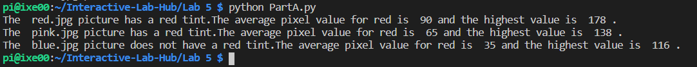
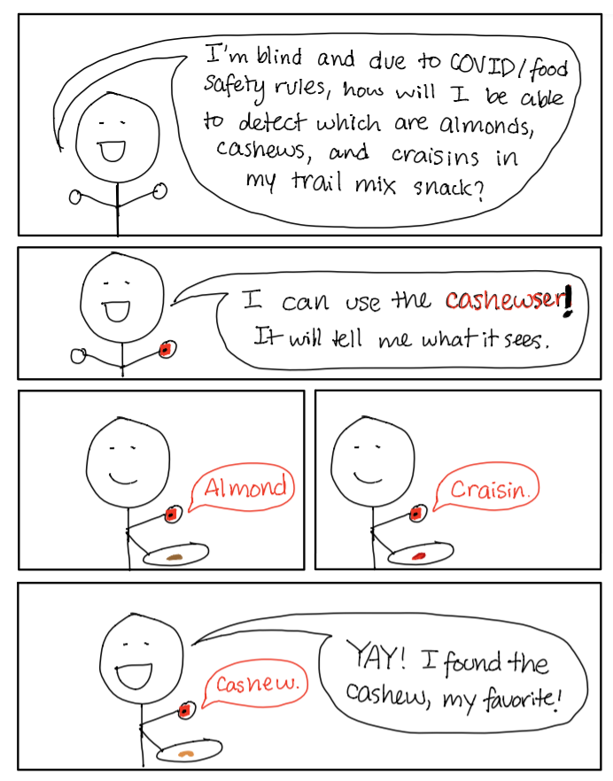

# Observant Systems


For lab this week, we focus on creating interactive systems that can detect and respond to events or stimuli in the environment of the Pi, like the Boat Detector we mentioned in lecture. 
Your **observant device** could, for example, count items, find objects, recognize an event or continuously monitor a room.

This lab will help you think through the design of observant systems, particularly corner cases that the algorithms need to be aware of.

In Lab 5 part 1, we focus on detecting and sense-making.

In Lab 5 part 2, we'll incorporate interactive responses.


## Prep

1.  Pull the new Github Repo.
2.  Read about [OpenCV](https://opencv.org/about/).
3.  Read Belloti, et al's [Making Sense of Sensing Systems: Five Questions for Designers and Researchers](https://www.cc.gatech.edu/~keith/pubs/chi2002-sensing.pdf)

### For the lab, you will need:

1. Raspberry Pi
1. Raspberry Pi Camera (2.1)
1. Microphone (if you want speech or sound input)
1. Webcam (if you want to be able to locate the camera more flexibly than the Pi Camera)

### Deliverables for this lab are:
1. Show pictures, videos of the "sense-making" algorithms you tried.
1. Show a video of how you embed one of these algorithms into your observant system.
1. Test, characterize your interactive device. Show faults in the detection and how the system handled it.


## Overview
Building upon the paper-airplane metaphor (we're understanding the material of machine learning for design), here are the four sections of the lab activity:

A) [Play](#part-a)

B) [Fold](#part-b)

C) [Flight test](#part-c)

D) [Reflect](#part-d)

---

### Part A
### Play with different sense-making algorithms.

Befor you get started connect the RaspberryPi Camera V2. [The Pi hut has a great explanation on how to do that](https://thepihut.com/blogs/raspberry-pi-tutorials/16021420-how-to-install-use-the-raspberry-pi-camera).  

#### OpenCV
A more traditional to extract information out of images is provided with OpenCV. The RPI image provided to you comes with an optimized installation that can be accessed through python.

Additionally, we also included 4 standard OpenCV examples. These examples include contour(blob) detection, face detection with the ``Haarcascade``, flow detection(a type of keypoint tracking), and standard object detection with the [Yolo](https://pjreddie.com/darknet/yolo/) darknet.

Most examples can be run with a screen (I.e. VNC or ssh -X or with an HDMI monitor), or with just the terminal. The examples are separated out into different folders. Each folder contains a ```HowToUse.md``` file, which explains how to run the python example.

```shell
pi@ixe00:~/openCV-examples $ tree -l
.
├── contours-detection
│   ├── contours.py
│   └── HowToUse.md
├── data
│   ├── slow_traffic_small.mp4
│   └── test.jpg
├── face-detection
│   ├── face-detection.py
│   ├── faces_detected.jpg
│   ├── haarcascade_eye_tree_eyeglasses.xml
│   ├── haarcascade_eye.xml
│   ├── haarcascade_frontalface_alt.xml
│   ├── haarcascade_frontalface_default.xml
│   └── HowToUse.md
├── flow-detection
│   ├── flow.png
│   ├── HowToUse.md
│   └── optical_flow.py
└── object-detection
    ├── detected_out.jpg
    ├── detect.py
    ├── frozen_inference_graph.pb
    ├── HowToUse.md
    └── ssd_mobilenet_v2_coco_2018_03_29.pbtxt
```
#### Filtering, FFTs, and Time Series data.
Additional filtering and analysis can be done on the sensors that were provided in the kit. For example, running a Fast Fourier Transform over the IMU data stream could create a simple activity classifier between walking, running, and standing.

Using the set up from the [Lab 3 demo](https://github.com/FAR-Lab/Interactive-Lab-Hub/tree/Spring2021/Lab%203/demo) and the accelerometer, try the following:

**1. Set up threshold detection** Can you identify when a signal goes above certain fixed values?
> We decided to process images taken by the PiCam, classifying them by saying whether the picture had a red tint or not.  We can extract the RGB values and see whether this R value goes underneath a certain value, which means that the picture does not have a red tint since the value is not very high.  The images that we are using are shown in the repo, and the code for this is found in [PartA.py](partA.py).  Note that we referenced [dispImage.py](dispImage.py) to display the image on the OLED screen.  Below is a snippet of the output when we run this file:
>
> 

**2. Set up averaging** Can you average your signal in N-sample blocks? N-sample running average?
> We can average the signal by specifying N number of samples, which we made N to be the number of pixels in the image.

**3. Set up peak detection** Can you identify when your signal reaches a peak and then goes down?
> We can identify when the signal holds certain ranges of values by showing the RGB values and plotting them to see where the peak ranges can be.  

Include links to your code here, and put the code for these in your repo--they will come in handy later.

#### Teachable Machines (beta, optional)
Google's [TeachableMachines](https://teachablemachine.withgoogle.com/train) might look very simple.  However, its simplicity is very useful for experimenting with the capabilities of this technology.

You can train a Model on your browser, experiment with its performance, and then port it to the Raspberry Pi to do even its task on the device.

Here is Adafruit's directions on using Raspberry Pi and the Pi camera with Teachable Machines:

1. [Setup](https://learn.adafruit.com/teachable-machine-raspberry-pi-tensorflow-camera/raspberry-pi-setup)
2. Install Tensorflow: Like [this](https://learn.adafruit.com/running-tensorflow-lite-on-the-raspberry-pi-4/tensorflow-lite-2-setup), but use this [pre-built binary](https://github.com/bitsy-ai/tensorflow-arm-bin/) [the file](https://github.com/bitsy-ai/tensorflow-arm-bin/releases/download/v2.4.0/tensorflow-2.4.0-cp37-none-linux_armv7l.whl) for Tensorflow, it will speed things up a lot.
3. [Collect data and train models using the PiCam](https://learn.adafruit.com/teachable-machine-raspberry-pi-tensorflow-camera/training)
4. [Export and run trained models on the Pi](https://learn.adafruit.com/teachable-machine-raspberry-pi-tensorflow-camera/transferring-to-the-pi)

Alternative less steps option is [here](https://github.com/FAR-Lab/TensorflowonThePi).

#### PyTorch  
As a note, the global Python install contains also a PyTorch installation. That can be experimented with as well if you are so inclined.

### Part B
### Construct a simple interaction.

Pick one of the models you have tried, pick a class of objects, and experiment with prototyping an interaction.
This can be as simple as the boat detector earlier.
Try out different interactions outputs and inputs.
**Describe and detail the interaction, as well as your experimentation.**

>Below is the interaction for the more complex scenario of someone who has poor eyesight or is blind and needs assistance in identifying various objects, such as a crasin, cashew, and almond.  Below is a storyboard of our interaction:
>
> 

### Part C
### Test the interaction prototype

Now flight test your interactive prototype and **note your observations**:
For example:
> 1. When does it what it is supposed to do?
> In good lighting, and when the ingredient is well centered and isolated in the PiCam frame, it is able to detect the difference between cashews, almonds, and craisins.
>
> 2. When does it fail?
> The first iteration fails when the ingredients are mixed, when the lighting is poor, or when random objects are disrupting the view of the PiCam.
>
> 3. When it fails, why does it fail?
> The model is trained on individual pictures of almonds, cashews, and craisins, with very similar lighting and background in all images. Thus, the model is not robust enough to compensate when the lighting is unexpected or multiple objects are in frame.
>
> 4. Based on the behavior you have seen, what other scenarios could cause problems?
> A scenario that could cause problems is if the user uses a plate that is a different color than the photos the model is trained on. Especially if the plate is more similar to the colors of the specific ingredients, it could skew the results to be biased toward a certain ingredient. 

**Think about someone using the system. Describe how you think this will work.**

> The visual identification provided by this system can be highly beneficial for blind and low-vision people. In the world of COVID-19, we are increasingly cautious about hygiene and food safety. This means that people are not able to use their sense of touch as freely as they used to. This system can be used to identify which ingredient is which in a batch of trail mix, without requiring the user to touch the questionable ingredients. 
>
>1. Are they aware of the uncertainties in the system?
> The user would be informed that the system is only trained on cashews, craisins, and almonds, and would not be able to detect other common trail-mix ingredients.
>
> 2. How bad would they be impacted by a miss classification?
> If someone is allergic to craisins or cashews or almonds, this model may not be the best choice. We would recommend that people who are allergic to the ingredients do not eat the trail mix due to cross-contamination. However, if they simply do not like one of the ingredients, it is not particularly harmful. 
>
> 3. How could change your interactive system to address this?
> The user can be told to spread out all of the trail mix ingredients on the plate. Space between the ingredients can ensure a more accurate scan of the plate and provide a more accurate indication of the ingredient distribution.
>
> 4. Are there optimizations you can try to do on your sense-making algorithm.
> In order to make our model more robust, we can add more pictures to continue training the model. These pictures can include the ingredients in much different lighting conditions.


### Part D
### Characterize your own Observant system

Now that you have experimented with one or more of these sense-making systems **characterize their behavior**.
During the lecture, we mentioned questions to help characterize a material:
> * What can you use *Cashewser* for?
> Cashewser is a visibility indication tool that can identify different ingredients in trailmix. (Particularly, cashews, almonds, and craisins)
>
> * What is a good environment for *Cashewser*?
> Cashewser is best used in consistent lighting, like one would normally have in their homes.
>
> * What is a bad environment for *Cashewser*?
> A bad environment for cashewser would be in overly shadowy or overly bright lighting.
>
> * When will *Cashewser* break?
> Cashewser will break outside of the model’s preferred conditions. For example, if there is no cashew, almond, or craisin in frame, Cashewser will still try to categorize everything it sees as one of those three ingredients.
>
> * When it breaks how will *Cashewser* break?
> Cashewser will continue to attempt to categorize things as either a cashew, almond, or craisin. This may manifest in cashewser trying to categorize your ceiling as a craisin.
>
> * What are other properties/behaviors of *Cashewser*?
> Cashewser provides auditory cues for its blind and low-vision users. 
>
> * How does *Cashewser* feel?
> Cashewser fits like a glove! In addition, the auditory cues are in a soothing voice that may be calming to the user.
>
> * Include a short video demonstrating the answers to these questions.
> Video is linked [here](https://www.youtube.com/watch?v=9gU5y1xZ5ng)

**Include a short video demonstrating the answers to these questions.**
