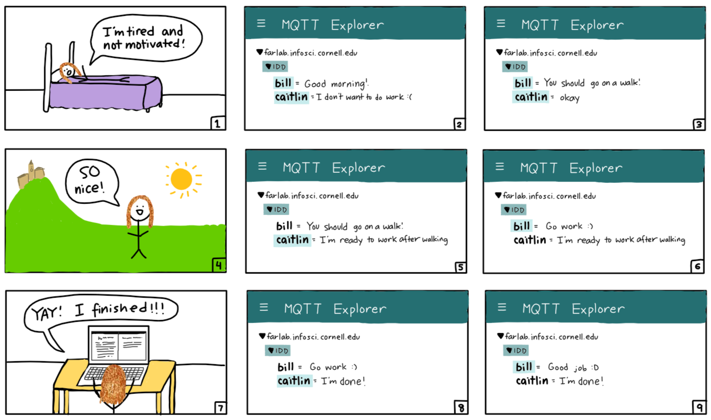

# m[Q](https://en.wikipedia.org/wiki/QAnon)tt[Anon](https://en.wikipedia.org/wiki/QAnon): Where We Go One, We Go All

Full documentation is found on [Caitlin's repository](https://github.com/caitlinstanton/Interactive-Lab-Hub/tree/Spring2021/Lab%206).

## Prep

1. Pull the new changes
2. Install [MQTT Explorer](http://mqtt-explorer.com/)
3. Readings 
   * [MQTT](#MQTT)
   * [The Presence Table](https://dl.acm.org/doi/10.1145/1935701.1935800) and [video](https://vimeo.com/15932020)


## Introduction

The point of this lab is to introduce you to distributed interaction. We've included a some Natural Language Processing (NLP) and Generation (NLG) but those are not really the emphasis. Feel free to dig into the examples and play around the code which you can integrate into your projects. However we want to emphasize the grading will focus on your ability to develop interesting uses for messaging across distributed devices. 

## MQTT

MQTT is a lightweight messaging portal invented in 1999 for low bandwidth networks. It was later adopted as a defacto standard for a variety of Internet of Things (IoT) devices. 

### The Bits

* **Broker** - The central server node that receives all messages and sends them out to the interested clients. Our broker is hosted on the far lab server (Thanks David!) at `farlab.infosci.cornell.edu/8883`
* **Client** - A device that subscribes or publishes information on the network
* **Topic** - The location data gets published to. These are hierarchical with subtopics. If you were making a network of IoT smart bulbs this might look like `home/livingroom/sidelamp/light_status` and `home/livingroom/sidelamp/voltage`. Subscribing to `home/livingroom/sidelamp/#` would give you message updates to both the light_status and the voltage. Because we use this broker for a variety of projects you have access to read, write and create subtopics of `IDD`. This means `IDD/ilan/is/a/goof` is a valid topic you can send data messages to.
*  **Subscribe** - This is a way of telling the client to pay attention to messages the broker sends out on that topic. You can subscribe to a specific topic or subtopics. You can also unsubscribe
* **Publish** - This is a way of sending messages to a topic. You can publish to topics you don't subscribe to. Just remember on our broker you are limited to subtopics of `IDD`

Setting up a broker isn't much work but for the purposes of this class you should all use the broker we've set up for you. 

### Useful Tooling

Debugging and visualizing what's happening on your MQTT broker can be helpful. We like [MQTT Explorer](http://mqtt-explorer.com/). You can connect by putting in the settings from the image below.


Once connected you should be able to see all the messaged on the IDD topic. From the interface you can send and plot messages as well.


## Send and Receive 

[sender.py](./sender.py) and and [reader.py](./reader.py) show you the basics of using the mqtt in python.  Lets spend a few minutes running these and seeing how messages are transferred and show up. 


To run these examples make sure to install the packages from `requirements.txt`


## The One True ColorNet

It is with great fortitude and resilience that we shall worship at the altar of the *OneColor*. Through unity of the collective RGB we too can find unity in our heart, minds and souls. With the help of machines can  overthrow the bourgeoisie, get on the same wavelength (this was also a color pun) and establish [Fully Automated Luxury Communism](https://en.wikipedia.org/wiki/Fully_Automated_Luxury_Communism).


The first step on the path to *collective* enlightenment, plug in the [APDS-9960 Proximity, Light, RGB, and Gesture Sensor](https://www.adafruit.com/product/3595).


You are almost there!

The second step to achieving our great enlightenment is to run `python color.py`

You will find the two squares on the display. Half is showing an approximation of the output from the color sensor. The other half is up to the collective. Press the top button to share your color with the class. Your color is now our color, our color is now your color. We are one. 

I was not super careful with handling the loop so you may need to press more than once if the timing isn't quite right. Also I have't load tested it so things might just immediately break when every pushes the button at once.

You may ask "but what if I missed class?"

Am I not admitted into the collective enlightenment of the *OneColor*?

Of course not! You can got to [https://one-true-colornet.glitch.me/](https://one-true-colornet.glitch.me/) and become one with the ColorNet on the inter-webs.

Glitch is a great tool for prototyping sites, interfaces and web-apps that's worth taking some time to get familiar with if you have a chance. Its not super pertinent for the class but good to know either way. 


## Make it your own

1. Explain your design For example, if you made a remote controlled banana piano, explain why anyone would want such a thing.

> Our design is an extension of our Lab 3 productivity assistant, biIl, which stands for “be intelligent In life.” In this application, the biIl-bot reads the user’s status updates to determine how productive (or unproductive) the user is at that time, and provides an appropriate response. This kind of productivity assistance is useful because it can be integrated into the user’s routine without any changes; the user can get productivity reminders and inspiration throughout their day by simply updating their status.


2. Diagram the architecture of the system. Be clear to document where input, output and computation occur, and label all parts and connections. For example, where is the banana, who is the banana player, where does the sound get played, and who is listening to the banana music?

> The system consists of an input from the user, and biIl is the system who takes in the input, figures out what type of advice or encouragement the person needs from this input (also known as where the computation occurs), and biIl delivers the output which is the determined piece of advice or encouragement.  This exchange is done via status updates, which can be viewed on the MQTT Explorer. bill uses machine learning to understand the context and tone of the status, and natural language generation to create a response with a cadence similar to that of a friend or mentor.
>
> Below is the storyboard that shows our system, consisting of Caitlin, the player or user, who is under the topic “caitlin”, and the system, who is biIl and under the topic “biIl” in the MQTT Explorer.  Every third panel, we see Caitlin’s life as she goes through various phases and then gets advice from biIl so she is more productive, or becomes more “intelligent in life.”  Note that in the storyboard, lightly shaded topic names in the MQTT Explorer indicate that the status has been updated.
>
> 
> 
> The first panel shows how Caitlin is very tired and is not motivated to do any work and when she tells this to biIl as shown on the second panel, biIl responds with taking a walk in the third panel, as that may motivate her. After Caitlin takes a walk and enjoys it, she tells biIl that she is now motivated to work and biIl encourages her as shown in panels 4 to 6.  Panel 7 shows how Caitlin is being productive and finishes her work.  When she tells biIl this, biIl affirms her in her productivity.


3. Build a working prototype of the system. Do think about the user interface: if someone encountered these bananas, would they know how to interact with them? Should they know what to expect?

> The user interface is fairly straightforward. Since people are used to social media, the idea of updating a status is intuitive. In addition, the minimal nature of the interface is less distracting than other social media platforms. This contributes to the productivity-centered nature of biIl, as the platform will not distract the user from being productive.
>
>bill is housed within the MQTT platform, which is a lightweight messaging protocol structured around topics. Our prototype uses a central server node hosted at ```farlab.infosci.cornell.edu/8883``` (with settings shown in the MQTT Explorer screenshot in the lab instructions) but for a more robust system we would need to set up server nodes across various locations to account for increased load due to large numbers of requests from high numbers of clients. This was shown to be a potential issue when the class was utilizing the farlab server all at once as there would be lag in sending/receiving messages. Two Python scripts need to be run in order to achieve full functionality: ```sender.py``` and ```reader.py```.
>
> ```sender.py``` instantiates an MQTT client with a random ID number and connects to the broker (```farlab.infosci.cornell.edu/8883```) via password authentication. It then relies on a forever loop of terminal inputs to either create a new topic, switch to another topic, or publish a message to the current topic. To create a new topic or switch to another topic, the user must type “new-topic”, which will break an inner forever loop while the program is waiting for a message and establish the topic to be “IDD/<the new input>”. Sending a message is as simple as typing in the terminal and the client running the ```publish(topic, val)``` command, where ```val``` is the terminal input and ```topic``` is the current topic name.
>
> ```reader.py``` doesn’t listen for a specific topic within “IDD/” but instead is able to see all messages. This is useful for our prototype specifically because this is meant to be a public lightweight social media platform where multiple people can post individual statuses. In this context, being able to see all subtopics under “IDD/” is equivalent to seeing all of your friends’ statuses (and bill’s response to your status!). When the program is first run, it creates a client and connects to the broker via password authentication (similar to ```sender.py```). Two callback functions are created: ```on_connect``` and ```on_message```. These functions only interrupt the program under specific circumstances (i.e. when ```reader.py``` is trying to connect to the broker, or when a new message was published to the broker). Callbacks are more time efficient than polling, which is when loops are used to constantly check on the status of a condition before prompting a certain reaction. ```on_message``` subscribes to all subtopics under “IDD/” using the ```subscribe(topic)``` function where ```topic``` equals “IDD/#”. ```on_message``` prints the newly published message with its corresponding topic and payload. A ```loop_forever``` call is the last function in the program; it blocks ```reader.py``` from ending. Typically this would inhibit further functionality, but since callbacks are built to interrupt currently running programs this program can still actively receive messages.  Below shows a screenshot of our system working.
>
> ![])(MQQtWindow.png)

4. Document the working prototype in use. It may be helpful to record a Zoom session where you use the input in one location clearly causing response in another location.

> Linked [here](https://youtu.be/jmoP3u7TDms) is our zoom recording of Caitlin interacting with biIl.
